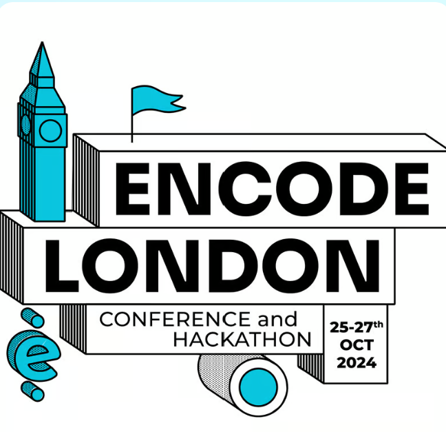

# Leeds University Cryptocurrency and Blockchain Society
Welcome to the Blockchain Society! We are a community dedicated to exploring and advancing the concepts and applications of blockchain technology. Whether you're a seasoned developer, a cybersecurity enthusiast, or someone curious about the potential of decentralized systems, you'll find a place here to learn, collaborate, and innovate.

# Table of Contents
- [About Us](#About-us)
- [Goals](#Goals)
- [Projects](#Projects)
- [Workshops](#Workshops)
- [Events](#Events)
- [Contact](#Contact)

# Latest Events: [London Encode Club Hackathon](https://www.encode.club/encodelondon-24)

### Stand With Crypto Bounty
We were able to win the stand with crypto bounty for making the best [content](https://www.youtube.com/watch?v=VqvV1iNAM1M) promoting on the venue, thanks to our member Astitva Mahavir Singh

# About Us
The Blockchain Society is a community-driven organization based at the University of Leeds. Our mission is to delve deep into blockchain technology, its underlying principles, and its real-world applications. We organize workshops, hackathons, and seminars to foster a collaborative environment where members can share knowledge and work on innovative projects.

# Goals
- **Education**: provide resources and training to help members understand blockchain fundamentals and advanced topics
- **Research**: Explore new blockchain technologies and their applications in various industries
- **Development**: Build and contribute to open-source blockchain projects
- **Community Building**: We hope to attract a community of like-minded builders from the university or out to work on cool projects

# Projects
We encourage members to engage in a variety of projects that span different aspects of blockchain technology.
### Current Big Project Ideas
- Currently brainstorming ideas of **private** blockchain system with own token
- Building a DAO to understand how it works

# Workshops
We will be hosting workshops that explores the financial side as well as the technical technology side.
### Workshop 1: Getting on chain (12-Nov-24)
We teach members on how to get on chain and set up a multi-chain wallet using backpack.

### Workshop 2: Bitcoin Workshop (22-Nov-24)
Bitcoin is the father of Blockchain technology. This workshop explores its history and how it became impactful towards various sectors of the world.

### Workshop 3: Bitcoin from Scratch in Python (27-Nov-24)
Based on Andrej Karpathy's Blog teaching members how to implement Bitcoin from Scratch with no dependencies to soak in the concepts and blockchain terminology.

# Events
- [Encode ETH Hackathon](https://www.encode.club/encodelondon-24)

# Contact
- Email: [luucabs@gmail.com](luucabs@gmail.com)
- Instagram: [luucabsoc](https://www.instagram.com/luucabsoc/)
